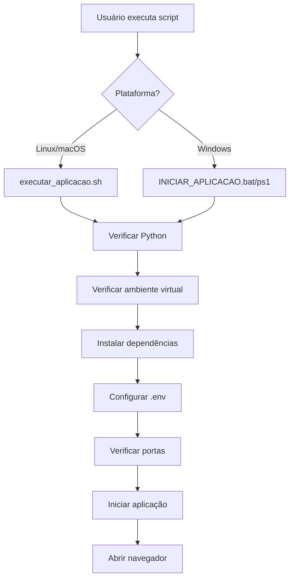

# 🚀 Scripts de Execução - OldNews FiscalAI

## 📋 Visão Geral

O OldNews FiscalAI inclui vários scripts para facilitar a execução da aplicação, desde usuários não-técnicos até desenvolvedores experientes.

## 🎯 Scripts Disponíveis

### 1. **executar_aplicacao.sh** (Linux/macOS) - ⭐ **RECOMENDADO**

**Para quem:** Usuários não-técnicos e desenvolvedores  
**Funcionalidade:** Execução completa e automatizada

```bash
./executar_aplicacao.sh
```

**O que faz:**
- ✅ Verifica Python 3.11+
- ✅ Cria/ativa ambiente virtual
- ✅ Instala todas as dependências
- ✅ Cria arquivo .env automaticamente
- ✅ Verifica e libera porta 8501
- ✅ Inicia a aplicação Streamlit
- ✅ Abre automaticamente no navegador

### 2. **INICIAR_APLICACAO.bat** (Windows)

**Para quem:** Usuários Windows não-técnicos  
**Funcionalidade:** Execução com duplo-clique

```cmd
INICIAR_APLICACAO.bat
```

**O que faz:**
- ✅ Verifica Python
- ✅ Cria/ativa ambiente virtual
- ✅ Instala dependências
- ✅ Configura .env
- ✅ Inicia aplicação

### 3. **INICIAR_APLICACAO.ps1** (Windows PowerShell)

**Para quem:** Usuários Windows com PowerShell  
**Funcionalidade:** Execução robusta com verificações

```powershell
.\INICIAR_APLICACAO.ps1
```

**O que faz:**
- ✅ Verificações completas
- ✅ Tratamento de erros
- ✅ Mensagens coloridas
- ✅ Configuração automática

### 4. **run_ui.sh** (Linux/macOS)

**Para quem:** Desenvolvedores que já têm ambiente configurado  
**Funcionalidade:** Execução rápida da interface

```bash
./run_ui.sh
```

**O que faz:**
- ✅ Ativa ambiente virtual
- ✅ Verifica dependências
- ✅ Inicia Streamlit

### 5. **run_api.sh** (Linux/macOS)

**Para quem:** Desenvolvedores que querem usar a API REST  
**Funcionalidade:** Execução da API FastAPI

```bash
./run_api.sh
```

**O que faz:**
- ✅ Ativa ambiente virtual
- ✅ Verifica dependências
- ✅ Inicia FastAPI na porta 8000

## 🔧 Scripts de Utilitários

### **limpar_processos.sh** (Linux/macOS)

**Para quem:** Desenvolvedores  
**Funcionalidade:** Limpa processos conflitantes

```bash
./limpar_processos.sh
```

### **test_script.sh** (Linux/macOS)

**Para quem:** Desenvolvedores  
**Funcionalidade:** Testa o script principal

```bash
./test_script.sh
```

## 📊 Comparação de Scripts

| Script | Plataforma | Usuário | Complexidade | Funcionalidades |
|--------|------------|---------|--------------|-----------------|
| `executar_aplicacao.sh` | Linux/macOS | Todos | Baixa | ⭐ Completa |
| `INICIAR_APLICACAO.bat` | Windows | Não-técnico | Baixa | ⭐ Completa |
| `INICIAR_APLICACAO.ps1` | Windows | Técnico | Média | ⭐ Completa |
| `run_ui.sh` | Linux/macOS | Desenvolvedor | Baixa | Interface |
| `run_api.sh` | Linux/macOS | Desenvolvedor | Baixa | API |

## 🎯 Recomendações de Uso

### **Para Usuários Não-Técnicos:**

1. **Linux/macOS:** Use `./executar_aplicacao.sh`
2. **Windows:** Use `INICIAR_APLICACAO.bat` (duplo-clique)

### **Para Desenvolvedores:**

1. **Primeira vez:** Use `./executar_aplicacao.sh` ou `INICIAR_APLICACAO.ps1`
2. **Desenvolvimento:** Use `./run_ui.sh` ou `./run_api.sh`
3. **Problemas:** Use `./limpar_processos.sh`

## 🚨 Solução de Problemas

### **Erro: "Python não encontrado"**
```bash
# Instale Python 3.11+ primeiro
# Ubuntu/Debian:
sudo apt update && sudo apt install python3.11 python3.11-venv

# macOS:
brew install python@3.11

# Windows: Baixe de python.org
```

### **Erro: "Porta em uso"**
```bash
# Linux/macOS:
./limpar_processos.sh

# Windows:
# Feche outros programas que usam a porta 8501
```

### **Erro: "Dependências faltando"**
```bash
# Execute o script completo:
./executar_aplicacao.sh
```

### **Erro: "Permissão negada"**
```bash
# Linux/macOS:
chmod +x *.sh

# Windows: Execute como administrador
```

## 📱 URLs de Acesso

- **Interface Web:** http://localhost:8501
- **API REST:** http://localhost:8000
- **Documentação API:** http://localhost:8000/docs

## 🔄 Fluxo de Execução



## 💡 Dicas

1. **Sempre execute no diretório raiz** do OldNews-FiscalAI
2. **Mantenha a janela do terminal aberta** enquanto a aplicação roda
3. **Use Ctrl+C** para parar a aplicação
4. **Configure sua API Key** na interface web
5. **Verifique os logs** se houver problemas

---

**Desenvolvido com ❤️ para facilitar o uso do OldNews FiscalAI**
